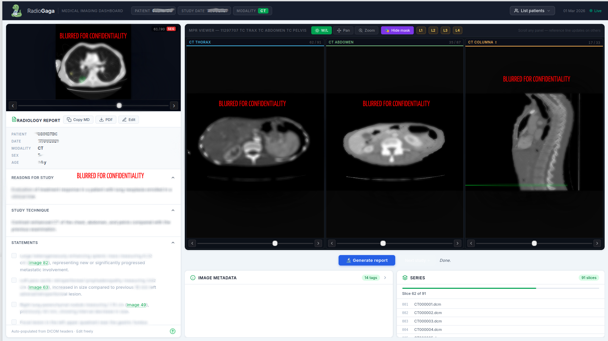

<div align="center">
  

  # radio-gaga

  **A prototype AI radiology assistant built in 24 hours.**

  
  
  
</div>

---

## The event

[UNBOXED 2026](https://lu.ma/k3reye0t) — *Medical AI Agentic: Lyon × Paris Hackathon* — brought together engineering, medical, and business students to prototype AI solutions at the intersection of AI and healthcare. In 24 intensive hours, teams tackled real clinical challenges with an emphasis on technical robustness, clinical relevance, and the ethical constraints specific to medical AI.

---

What we did:





## What is radio-gaga?

radio-gaga is a prototype of a complete assistant for radiologists. Given a DICOM study and its segmentation mask, it automatically generates a structured report — and lets the radiologist read, inspect, and correct it in the same interface.

The three design goals are **speed**, **explainability**, and **correctability**: the tool should get you most of the way there instantly, and never make it painful to take back control.

### Vision

A good AI assistant should give you a meaningful speedup 90% of the time. But it also has to be easy to inspect when something looks off — because that's the thing the radiologist will spend the most time doing. The worst outcome is a tool that is fast when it works and frustrating when it doesn't. radio-gaga is designed so that correcting the model is a natural part of the workflow, not an afterthought.

---

## Team

- [Gabriel DUPUIS](https://github.com/puushtab)
- [Thibault Maurel](https://github.com/ThibaultMaurelOujia)
- [Axel Noir]()
- [Antonin PERONNET](https://github.com/rambip)
- [Nathan ROOS](https://github.com/nroos-fr)

---

## A note on privacy

This prototype is intended for use with anonymised or synthetic data only. **Do not use it with real patient data** in its current state: it offers no access control beyond a simple password gate, no audit logging, and no RGPD-compliant data handling. Any production use would require a full compliance review before deployment in a clinical setting.

---

## Pipeline

```
┌─────────────────────┐
│   Orthanc server    │  DICOM studies + segmentation masks
└────────┬────────────┘
         │  generate_data.py  (download & extract)
         ▼
┌─────────────────────┐
│   /data/studies     │  local DICOM + mask files
└────────┬────────────┘
         │
         ▼
┌─────────────────────┐
│   FastAPI backend   │  serves files, calls OpenRouter LLM
└────────┬────────────┘
         │  REST + static
         ▼
┌─────────────────────┐
│   React frontend    │  Cornerstone.js viewer, report editor
└─────────────────────┘
```

> **Note on reproducibility:** this repository is not intended to be fully reproducible outside the hackathon context. There is no real segmentation algorithm — the masks are mockups provided by the organisers. Running the full pipeline also requires access to a private Orthanc database and an OpenRouter API key.

---

## Installation

### Prerequisites

- Python 3.10+, with the backend virtualenv set up at `backend/.venv`
- Node 18+
- Access to an Orthanc instance
- An OpenRouter API key
- A mock segmentation output (provided by hackathon organisers)

### 1. Configure environment variables

See [SETUP.md](SETUP.md) for a full description of all required variables.

### 2. Download DICOM data

```bash
python generate_data.py
```

### 3. Start the app

```bash
bash start.sh
```

This launches the FastAPI backend and the Vite dev server in the background. Logs are written to `backend.log` and `frontend.log`.

---

## License

MIT — see [LICENSE](LICENSE) for details.
